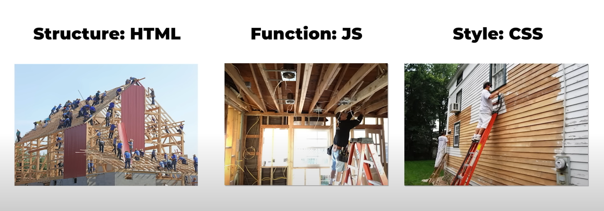

# A Webpage

+ A web page is a simple document displayable by a browser. Such documents are written in the HTML language 
  (which we look into in more detail in other articles). 
        A web page can embed a variety of different types of resources such as: style information — controlling a page's look-and-feel.


+ A web page can embed a variety of different types of resources such as:

  + style information — controlling a page's look-and-feel
  + scripts — which add interactivity to the page
  + media — images, sounds, and videos.

---

# A Website

+ Connecting many webpages would be a website, (based on the url).
+ A website is a collection of linked web pages (plus their associated resources) that share a unique domain name.

---


## Static Webpage
+ When you simply need a couple of pages on your site and don't need the data to change, a static design is the best. The info on a static site continues as before and has no changes occurring in the course of time. 
  Static websites are made in HTML, CSS and Java. They are simple to create and are easily crawled by search engines.

+ Documentation, Forms, Newsletter Contents(Substack, Revue, Ghost, Mailmodo, ConvertKit, Mailchimp)
+ Brochure websites act like printed brochures for the digital world.

https://rigorousthemes.com/blog/best-brochure-website-examples/

---

## Dynamic Webpage
+ A dynamic website design can convey dynamic data. This implies relying upon changes occurring;

+ Any e-commerce website.
+ Amazon, Flipcart.
---

## URL

+ A URL (Universal Resource Locator) is a complete web address used to find a particular web page.
  While the domain is the name of the website, a URL will lead to any one of the pages within the website.

+ http://www.example.com/index.html 

  http → Protocol
  www.example.com → Hostname
  index.html → File Name

---

## Domain Name

+ A domain name (often simply called a domain) is an easy-to-remember name that’s associated with a 
  physical IP address on the Internet.

+ Using a domain name to identify a location on the Internet rather than the numeric IP address makes it 
  much easier to remember and type web addresses.

---

## IP Address

+ An IP address is a unique address that identifies a device on the internet or a local network.

+ An IP address is a 32-bit number. It uniquely identifies a host (computer or other device, such as a printer 
  or router) on a TCP/IP network. 
      IP addresses are normally expressed in dotted-decimal format, with four numbers separated by periods, 
      such as 192.168. 123.132.
---

## Front-End Technologies
+ HTML
+ CSS
+ Javascript
---



---
## IDE

+ VSCode IDE
---

# HTML

+ HTML(HyperText Markup Language) is used for structural purposes on a web page, not functional ones. 
  Programming languages have functional purposes.

+ It encapsulates, or “marks up” data within HTML tags, which define the data and describe its purpose 
  on the webpage. The web browser then reads the HTML, which tells it things like which parts are headings, which parts are paragraphs, which parts are links, etc. 
            The HTML describes the data to the browser, and the browser then displays the data accordingly.

+ However, this is not programming. The above is not an example of an executable script. 
  The HTML was only used in the above to mark up the text for the browser to read and interpret as web page content. 
    It told the browser which parts where headings, which were paragraphs, and which were links, and the browser displayed them as such. HTML is used for structural purposes on a web page, not functional ones.
---

# BoilerPlate

+ Boilerplate code or just boilerplate are sections of code that are repeated in multiple places with 
  not much variations. 
    A boilerplate in HTML is a template you will add at the start of your project. 
    You should add this boilerplate to all of your HTML pages.

+ To generate it, we use the shorthand command by typing [ ! ] + [ tab ] on an HTML file opened in a 
  code editor with Emmet.

+   ```html
        <!DOCTYPE html>
        <html lang="en">
        <head>
            <meta charset="UTF-8">
            <meta http-equiv="X-UA-Compatible" content="IE=edge">
            <meta name="viewport" content="width=device-width, initial-scale=1.0">
            <title>Document</title>
        </head>
        <body>
            
        </body>
        </html>
    ```

+ < !DOCTYPE html >
    + Browsers to determine whether to render the webpage in standards mode 
    (which is according to CSS specifications) or quirks mode (which is more backwars compatible with old practices and old browsers)
        
    + The browser may render the webpage in quirks mode, which may not be aligned to CSS specifications.

+ < html lang="en" >
    + The < html > element represents the root of an HTML document.
      The lang attribute is added to specify the document’s language for all the text on the page.

    + What happens if we don’t add this?

        We can’t access the benefits that lang attribute offers.
        They include:
            + Varying the styling of content by language — e.g., fonts or line spacing, 
              style-generated quotation   marks, and emphasis may differ by language
            + Selecting language-appropriate fonts

+ < head > 
    + The head element represents a collection of metadata for the Document.

    + The browser seems to add it automatically. When I tried removing it from my file and open it on browser,  
      the < head > tag showed up.


## HTML Meta Tags
#### Meta tags provide data about a web page -
+  title, author, keywords, etc.
#### They also provide instructions to the browser 
+ how to display content.
### Meta tags
+ All < meta > tags are placed inside a < head > element
+ Meta data is passed as name/content pairs
+ Meta data is used by the browser, Users will not see this.
+ Important for Search Engine Optimization (SEO)
---
### Meta tags
+ < meta name="title" content="____">      Page title
+ < meta name="description" content="_____">   Describes the page contents 
+ < meta name="keywords" content="_____"> List of keywords about the page.
+ < meta name="author" content="_____"> Page author. A person/ an organization.
+ < meta name="viewport" content="width=device-width, initial-scale=1.0">   Defines how to control the dimension and scaling of a page.
-width=device-width - sets the page width to be the same as the device width (which varies by device).
- initial-scale=1.0 - sets the initial zoom level to 100% when the page is loaded.

+ < meta charset=“UTF-8”> 
    + This specifies the character encoding for the HTML document.

    + W3C states that we should always choose the UTF-8 character encoding for our content.

    + UTF-8 supports many languages and can accommodate pages and forms in any mixture of those languages.

    + If you don’t, characters in your content can be incorrectly interpreted and that may produce 
       gibberish content that no one can decipher.

+ < meta http-equiv=”X-UA-Compatible” content=”ie=edge” />
    + This allows web authors to choose the Internet Explorer version for which the page should be rendered. 
      ie=“edge” mode tells Internet Explorer to display content in the highest mode available.

    + If you don't, Internet Explorer will determine the version of Internet Explorer to render, 
      and it may not be the version we want.


+ < meta name=”viewport” content=”width=device-width, initial-scale=1.0">
    + This is used to improve the presentation of the webpage across different devices and it translates to:
    ```
        @viewport {
        width: extend-to-zoom 100%;
        height: auto;
        zoom: 1.0;
        }
    ```

    + The width and height properties control the size of the viewport, while the initial-scale property 
       controls the zoom level when the page is first loaded.

    + If we don't, The webpage may appear zoomed out on the device screen.

+ < title>Document< /title>
    +   This is designed to provide a title to be displayed on:

        + The browser’s title bars
        + Bookmark lists
        + Result lists from search services

    + Although the webpage works, W3C states it’s a requirement unless it’s reasonable to exclude — 
      e.g., if the document is an iframe srcdoc document or if title information is available from a higher-level protocol.

+ < body> represents the content of the document.
    + The page will still work, but that is unlikely what we want. Why would we want an blank webpage !

+ < link>
    + It is not added by default, we will add only when necessary.
    + We will include < link> tag, before < title> tag.
    + We use the < link> element to add external information related to the HTML document.
        e.g., CSS document.
    + It is fine to exclude the < link> element if the webpage doesn’t require it.
    + < link rel="stylesheet" href="styles.css">
        // href → Specifies the location of the linked document
        // rel → Specifies the relationship between the current document and the linked document

+ < script>
    + It is not added by default, we will add only when necessary.
    + We will include < script> tag, before closing < /html> tag.
    + The script element allows authors to include dynamic script and data blocks in their documents.
    + The < script> tag is used to embed a client-side script (JavaScript).
    + The < script> element either contains scripting statements, or it points to an external script file 
      through the src attribute.
    + Common uses for JavaScript are image manipulation, form validation, and dynamic changes of content.
    + < script type="text/javascript" src="./js/scroll.js">< /script>
        // type → (URL)Specifies the media type of the script
        // src → (scripttype)Specifies the URL of an external script file

---

# Heading tags (h1 -h6)

+ < h1> Displays content as a heading < h1> being the largest to < h6> the smallest.
+ < h1>The biggest heading< /h1>
+ < h2>< /h2>
+ < h3>< /h3>
+ < h4>< /h4>
+ < h5>< /h5>
+ < h6>The smallest heading< /h6>.
---
# Block (div) and Inline (span) Tags

+ Every HTML element has a default display value, depending on what type of element it is.
+ There are two display values: block and inline.

## Block

+ A block-level element always starts on a new line, and the browsers automatically add some space(a margin) 
  before and after the element.

+ A block-level element always takes up the full width available (stretches out to the left and right as far 
  as it can).

+ Here are the block-level elements in HTML:
  ```html
    <address><article><aside><blockquote><canvas><dd><div><dl><dt><fieldset><figcaption><figure><footer><form>
    <h1>-<h6><header><hr><li><main><nav><noscript><ol><p><pre><section><table><tfoot><ul><video>
  ```

+ 
```html  
  <!DOCTYPE html>
    <html>
    <head>
    <style>
    .myDiv {
      border: 5px solid green;
      background-color: lightyellow;    
      text-align: center;
    }
    </style>
    </head>
    <body>
    <h1>The div element</h1>
    <div class="myDiv">
    The content inside a div element.
    </div>
    <p>This is some text outside the div element.</p>
    </body>
    </html>
  ```

+ < h1>WHY DO FRONT < div align="center">END< /div> COURSE< /h1>

## Inline

+ An inline element does not start on a new line.
+ An inline element only takes up as much width as necessary.
+ HTML < span> tags define an inline container. It can be used for styling purposes 

+   
  ```html
    <!DOCTYPE html>
      <html>
      <head>
      <style>
      .mySpan {
        border: 5px solid green;
        background-color: lightyellow;    
        text-align: center;
      }
      </style>
      </head>
      <body>
      <h1>The div element</h1>
      <div class="mySpan">
      The content inside a span element.
      </div>
      <p>This is some text outside the div element.</p>
      </body>
      </html>
  ```

+ < h1>WHY DO FRONT < span align="center">END< /span> COURSE< /h1>

+ Here are the inline elements in HTML:

```html
    <a><abbr><acronym><b><bdo><big><br><button><cite><code><dfn><em><i><input><kbd><label><map><object>
    <output><q><samp><script><select><small><span><strong><sub><sup><textarea><time><tt><var>
```
---

# Semantic Tag

+ A semantic element clearly describes its meaning to both the browser and the developer.
+ Tags are, < header>, < footer>.
+ The < header> element is generally found at the top of a document, a section, or an article and usually 
   contains the main heading and some navigation and search tools.

+   
  ```html
    <!DOCTYPE html>
    <html>
    <head>
    <style>
    .myDiv {
      border: 5px solid green;
      background-color: lightyellow;    
      text-align: center;
    }
    </style>
    </head>
    <body>
    <header>
    <h1>Company A</h1>
    <ul>
      <li><a href="#">Home</a></li>
      <li><a href="#">About</a></li>
      <li><a href="#">Contact us</a></li>
    </ul>
    </header>
    </body>
    </html>
  ```

+ Nav
  ```
    <nav>
      <a href="/html/">HTML</a> |
      <a href="/css/">CSS</a> |
      <a href="/js/">JavaScript</a> |
    </nav>
  ```

+ Article

  You should use the HTML article element in the following situations:

  Writing a forum post
  Creating a blog post
  Publishing a news story

  This element does not have any styling values and is simply going to divide your content. However, you can use specific CSS styling properties to change the visual output. We are going to provide you with the two syntaxes so you can see how simple it is to implement them.

  ```html
    
      <article class=”all-browsers”>
        <h1> Most Popular Web Browsers </h1>
        <article class=”browser”>
          <h2> Google Chrome </h2>
          <p> Google Chrome is one of the most widely used browsers today. It was released in 2008 by Google.  </p>
        </article>
        <article class=”browser”>
          <h2> Mozilla Firefox </h2>
          <p> Mozilla Firefox recently became the most most popular browser. It was designed by Mozilla. </p>
        </article>
        <article class=”browser”>
          <h2> Microsoft Edge </h2>
          <p> Microsoft Edge replaces Internet Explorer. Microsoft designed and released it in 2015. </p>
        </article>
      </article>

  ```
+ Section

  The HTML section element represents a generic sectioning element because it divides the document into thematically defined pieces. As with the HTML article, this element is also followed by a heading and a paragraph. 
    Web developers usually use this element to divide long documents into chapters, create different tabs, and divide various themes on your web page. Furthermore, you are supposed to use the following tags inside the HTML section element:

  ```html
      <main>
      <header>
      <footer>
      <nav>
      <aside>


  <section>
      <h1> Advertisement </h1>
      <p><a href=”http://www.AnExampleWebPage.com”> The new frogger shaper 5000. Everything you need to keep fit this winter! </a> </p>
  </section>
  <main>
      <h1> How to keep yourself fit during the pandemic? </h1>
      <p> During the global pandemic it is very important to have a healthy lifestyle… </p>
  </main>
  <section>
      <h1> Other articles </h1>
      <ul>
        <li> <a href=”eat-vegetables.html”> Include healthy vegetables in your diet </a> </li>
        <li> <a href=”eat-fruits.html”> Include various fruits in your diet </a> </li>
      </ul>
  </section>
  ```

+ Footer
  ```html
  <!DOCTYPE html>
    <html>
      <head>
      <link rel="stylesheet" href="https://cdnjs.cloudflare.com/ajax/libs/font-awesome/4.7.0/css/font-awesome.min.css">
      <style>
      .myDiv {
          border: 5px solid green;
          background-color: lightyellow;    
          text-align: center;
        }
        </style>
      </head>
      <body>
      <footer>
      <section class="copyright">
    <h6>Copyright © All rights reserved</h6>
    <div class="social-media">
    <a href="www.twitter.com" target="_blank"><i class="fa fa-twitter" aria-hidden="true"></i></a>
    <a href="www.facebook.com" target="_blank"><i class="fa fa-facebook" aria-hidden="true"></i></a>
    <a href="www.behance.com" target="_blank"><i class="fa fa-behance" aria-hidden="true"></i></a>
    <a href="www.globe.com" target="_blank"><i class="fa fa-globe" aria-hidden="true"></i></a>
    </div>
    </section>
    </footer>
    </body>
    </html>
  ```

# Image Tag

+ The < img> tag is used to embed an image in an HTML page.
+ Images are not technically inserted into a web page; images are linked to web pages. 
+ The < img> tag creates a holding space for the referenced image.
+ The < img> tag has two required attributes:
    + src - Specifies the path to the image
    + alt - Specifies an alternate text for the image, if the image for some reason cannot be displayed

 ## < img>  used to embed an image to a web page.
  * This is an empty tag
  * < img src="___" alt ="____"> 
  * src (source) attribute Specifies the name/location of the image.
  * alt is used to provide browsers with an alternate text in case when the image cannot be displayed
  ```html
   
   ```

```html
 <!DOCTYPE html>
  <html>
  <head>
      <meta charset="UTF-8">
      <meta http-equiv="X-UA-Compatible" content="IE=edge">
      <meta name="viewport" content="width=device-width, initial-scale=1.0">
      <title>Document</title>
  </head>
  <body>
  <h1>The img element</h1>
  
  </body>
  </html>
  ```
---

## Anchor tag

### < a>  Used to create hyperlinks. Hyperlinks interconnect the current web page with other web pages or any other web resource like image, a video.
 * < a href="https://www.google.co.in/"> This attribute is used to specify the URL or filename.
 * < a id= "  "> Used to create a fragment identi fier in the document.
 * URL -Uniform Resource Locator

```html
  <h2>Hyperlink </h2>
  <a href="https://www.google.com/"> click for google </a>
  <h2>Internal link </h2>
  <h1 id="top">Page Title</h1> 
  ...
  <a href="#top">Scroll to Top</a>
```
---
The target attribute defines how the document will open. 

_blank: It opens the document into the new tab or window.
_top: It opens the attached document in the full window.
_self: It opens the document into the same window or same tab in which it is clicked. The default, this target is enabled. 
< a href="http://www.google.co.in" target="_blank" >Google search < /a>

---
# Lists (unordered lists and ordered lists)

+ HTML lists allow web developers to group a set of related items in lists.

## UnOrdered List

+ An unordered list starts with the < ul> tag. Each list item starts with the < li> tag.
+ The list items will be marked with bullets (small black circles) by default:
+ ```html
    <!DOCTYPE html>
    <html>
    <head>
            <meta charset="UTF-8">
            <meta http-equiv="X-UA-Compatible" content="IE=edge">
            <meta name="viewport" content="width=device-width, initial-scale=1.0">
            <title>Document</title>
    </head>
    <body>
    <h1>The Un-Ordered List Elements</h1>
    <ul style="list-style-type:disc;"> // "circle", "square", "none"
        <li>Coffee</li>
        <li>Tea</li>
        <li>Milk</li>
    </ul>
    </body>
    </html>
  ```
+ Create an unordered list of your favorite cool-drinks.

## Ordered List

+ An ordered list starts with the < ol> tag. Each list item starts with the < li> tag.
+ The list items will be marked with numbers by default:
+ ```html
    <!DOCTYPE html>
    <html>
    <head>
            <meta charset="UTF-8">
            <meta http-equiv="X-UA-Compatible" content="IE=edge">
            <meta name="viewport" content="width=device-width, initial-scale=1.0">
            <title>Document</title>
    </head>
    <body>
    <h1>The Ordered List Elements</h1>

    <ol type="I"> // "A", "a", "1", "i"
        <li>Coffee</li>
        <li>Tea</li>
        <li>Milk</li>
    </ol>
    </body>
    </html>
  ```

+ Create an ordered list of your favorite vacation spot.
---

# i tag

+ The content inside is typically displayed in italic.
+   ```html
    !DOCTYPE html>
    <html>
    <head>
      <meta charset="UTF-8">
      <meta http-equiv="X-UA-Compatible" content="IE=edge">
      <meta name="viewport" content="width=device-width, initial-scale=1.0">
      <title>Document</title>
    </head>
    <body>
      <h1>The  Italic Element</h1>
      <p><i>Lorem ipsum</i> is the most popular filler text in history.</p>
    </body>
    </html>
    ```
---

## Forms- Used to accept user input, that is most often sent to a server for processing.

 ```HTML
  <form>
    ... add form elements ...
  </form>
 ```
----
### The name attribute 
Identifier attribute that’s used for sending data through the HTML form elements.
```html
<body>
  <form method="GET">
    <input type="text" name="username" />
    <input type="password" name="password" />
    <input type="submit" value="Submit" />
  </form>
</body>
```
+ Without the name attribute, any value you have in the HTML form element such as < input>, < select>, or < textarea> element will be excluded from the form submission.

----

### The id attribute - Is a unique identifier for HTML tags.

+ In the past, the rule for CSS styling is that unique styles are applied to the id while general styles are applied to the class.
+ modern CSS practice tends to style everything using class 
+ the id attribute is now mostly used to associate the <label> tag with an input element.


----
## < label> 
### Defines a label for form elements. Meant for display, cannot take input.
```HTML
<form>
  <label for="first_name">First name:</label><br>
  <label for="last_name">Last name:</label><br>
</form>  
```
+ The 'for' attribute will associate that label with the < input type="text" id="first_name" /> element.
+ Useful for screen-reader users, because the screen-reader will read out loud the label when the user focus on the input element.
+ Help users who have difficulty clicking on very small regions (such as radio buttons or checkboxes) - because when the user clicks the text within the < label> element, it toggles the radio button/checkbox.

 > https://developer.mozilla.org/en-US/docs/Web/HTML/Element/label
---
### < input> Used to input through various modes as specified in type="___" attribute. radio, text, button to name a few.
### < input type="text">  Single-line text input field
```HTML
  <label for="fname">First name:</label><br>
  <input type="text" id="fname" name="fname"><br>
  <label for="lname">Last name:</label><br>
  <input type="text" id="lname" name="lname">
```
+ name  attribute is used to specify the name of the input component.

---
### < input type="date"> Used to accept date input.

```HTML
<form>
  <label for="doj">Date of joining :</label>
  <input type="date" id="doj" name="dote_o_j">
</form>
```


### < input type="email"> Used to input an e-mail address.
```html
<form>
  <label for="email">Enter mail id :</label>
  <input type="email" id="email" name="email">
</form>
```
---
 ### < input type="number"> defines a numeric input.

```html 
<form>
  <label for="No of books">Quantity (between 1 and 10):</label>
  <input type="number" id="books" name="books" min="1" max="10">
</form>
```
+ min - specifies the smallest value that can be given
+ max - specifies the largest value that can be given

### < input type="range"> Used to enter a number using slider control.

```html
<form>
  <label for="rate">Volume (between 0 and 10):</label>
  <input type="range" id="rate" name="rate" min="0" max="10">
</form>
```
+ Default range is 0 to 100.
---
### < input type="submit" value="Login">	 Defines a button for submitting form data to a form-handler.
### < input type="reset" value="Clear-data">	 Defines a button to empty the form.
### < input type="button" value="Add">	Displays a clickable buttons, which can be programmed to control custom functionality anywhere on a webpage as required when assigned an event handler function.
+ value attribute contains a string that is used as the button's label.
```html
<input type="submit" value="Login">
<input type="reset"  value="Erase data">
<input type="button" value="Add to fav">
```
## Attributes of the input element
+ value="___"  Specifies an initial value for an input field.
+ size="___"   specifies the visible width(number of characters), of an input field
+ maxlength="___" Specifies the maximum number of characters allowed.
+ min="___" Specifies the minimum value for an input field.
+ max="___" Specifies maximum values for an input field.
+ placeholder="___" Specifies a short hint  describing the expected value 
---
## Attributes of the input element
+ required - Specifies that an input field must be filled out before submitting.
+ multiple - Allows user to enter more than one value. Works with email,file.
+ readonly - Denotes that an input field cannot be modified. The value will be sent when submitting the form.
+ disables - Specifies that an input field should be disabled. The value will not be sent when submitting the form.
+ autofocus - Specifies that an input field should automatically get focus when the page loads.

---
# FOR attribute in LABEL

for: It refers to the input control that this label is for. Its value must be the same as the value of the input control's “id” attribute. form: It refers to the form to which the label belongs to.

---
# NAME attribute in INPUT
---
### The name attribute specifies the name of an < input> element. The name attribute is used to reference elements in a JavaScript, or to reference form data after a form is submitted. Note: Only form elements with a name attribute will have their values passed when submitting a form.
---

# VALUE attribute in INPUT
---
### The value attribute specifies the value of an < input> element. The value attribute is used differently for different input types: For "button", "reset", and "submit" - it defines the text on the button. For "text", "password", and "hidden" - it defines the initial (default) value of the input field.

---
### For a < label> to work properly, it must include a for attribute, which identifies the < input> to which it is associated. The for attribute's value should match the id (not the name ) of the < input> element. (Form submission relies on name and label pairing relies on id .

---

### HTML should also be semantic. Meaning that the tags you use should express their function in the document. The < label> tag is just that, while the p tag is just a text dump. 
---

---

### The id attribute - Is a unique identifier for HTML tags.

+ In the past, the rule for CSS styling is that unique styles are applied to the id while general styles are applied to the class.
+ modern CSS practice tends to style everything using class 
+ the id attribute is now mostly used to associate the < label> tag with an input element.

---


### < input type="radio">	Displays a radio button lets the user select any ONE of a limited number of choices.
```HTML
<p>Choose your favorite Web language:</p>
<form>
    <input type="radio" id="html" name="fav_lang" value="HTML">
    <label for="html">HTML</label><br>
    <input type="radio" id="css" name="fav_lang" value="CSS">
    <label for="css">CSS</label><br>
    <input type="radio" id="javascript" name="fav_lang" value="JavaScript">
    <label for="javascript">JavaScript</label>
</form>     
```
Here id is to identify the individual button and name is to identify the whole cluster that makes up the input.

---

### < input type="checkbox">	Displays a checkboxCheckboxes let a user select zero or morethan 1 options of a limited number of choices.
```html
  <input type="checkbox" id="vehicle1" name="vehicle1" value="Bike">
    <label for="vehicle1"> I have a bike</label><br>
  <input type="checkbox" id="vehicle2" name="vehicle2" value="Car">
    <label for="vehicle2"> I have a car</label><br>
  <input type="checkbox" id="vehicle3" name="vehicle3" value="Boat">
    <label for="vehicle3"> I have a boat</label>
```
---

### < select> Used to create a dropdown list.
```HTML 
<label id="cit"> City  :</label>
<select id="cit" name="city" size="2">
      <option>Pune</option>
      <option>Mumbai</option>
      <option selected>Nasik</option>
</select>
```
+ selected  Shows the option selected by default
+ size="___" Specifies the number of options displayed aat a time.
---
### < textarea > 
* This is used to create a multi-line text field, mainly  to collect reviews and comments.
### rows -number of horizontal lines, 
```html
  <textarea row="4" cols="50">
  </textarea>
```

---
# HTML FORMS

+ An HTML form is used to collect user input. The user input is most often sent to a server for processing.

+ The < form> element is a container for different types of input elements, such as: text fields, checkboxes, 
  radio buttons, submit buttons, etc.
---
## Label element

+ The < label> element defines a label for several form elements.
+ The for attribute of the < label> tag should be equal to the id attribute of the < input> element to bind 
  them together.

---

## Input tag

+ The < input> tag specifies an input field where the user can enter data.
+ The < input> element is the most important form element.
+ The < input> element can be displayed in several ways, depending on the type attribute.
---
### Input type radio

+ < input type="radio"> defines a radio button.
+ Radio buttons let a user select ONLY ONE of a limited number of choices:
+   ```html
        <!DOCTYPE html>
        <html>
        <head>

            <meta charset="UTF-8">
            <meta http-equiv="X-UA-Compatible" content="IE=edge">
            <meta name="viewport" content="width=device-width, initial-scale=1.0">
            <title>Document</title>
        </head>
        <body>
        <form>
          <input type="radio" id="html" name="fav_language" value="HTML">
          <label for="html">HTML</label><br>
          <input type="radio" id="css" name="fav_language" value="CSS">
          <label for="css">CSS</label><br>
          <input type="radio" id="javascript" name="fav_language" value="JavaScript">
          <label for="javascript">JavaScript</label><br><br>
          <input type="submit" value="Submit">
        </form>
        </body> 
        <html>
    ```
---
### Input type checkbox

+ < input type="checkbox"> defines a checkbox.
+ Checkboxes let a user select ZERO or MORE options of a limited number of choices.

+   ```html
        <!DOCTYPE html>
        <html>
        <head>

            <meta charset="UTF-8">
            <meta http-equiv="X-UA-Compatible" content="IE=edge">
            <meta name="viewport" content="width=device-width, initial-scale=1.0">
            <title>Document</title>
        </head>
        <body>
        <form>
            <input type="checkbox" id="vehicle1" name="vehicle1" value="Bike">
            <label for="vehicle1"> I have a bike</label><br>
            <input type="checkbox" id="vehicle2" name="vehicle2" value="Car">
            <label for="vehicle2"> I have a car</label><br>
            <input type="checkbox" id="vehicle3" name="vehicle3" value="Boat">
            <label for="vehicle3"> I have a boat</label><br><br>
            <input type="submit" value="Submit">
        </form>   
        </body>
        </html>
    ```

### Input type submit

+ The < input type="submit"> defines a submit button which submits all form values to a form-handler.
+ The form-handler is typically a server page with a script for processing the input data.
+ The form-handler is specified in the form's action attribute.

+   ```html
        <!DOCTYPE html>
        <html>
        <head>

            <meta charset="UTF-8">
            <meta http-equiv="X-UA-Compatible" content="IE=edge">
            <meta name="viewport" content="width=device-width, initial-scale=1.0">
            <title>Document</title>
        </head>
        <body>
        <h1>Display a Submit Button</h1>

        <form action="/action_page.php">
        <label for="fname">First name: </label>
        <input type="text" id="fname" name="fname"><br><br>
        <label for="lname">Last name: </label>
        <input type="text" id="lname" name="lname"><br><br>
        <input type="submit" value="Submit">
        </form> 

        <p>If you click the "Submit" button, the form-data will be sent to a page called "/action_page.php".</p>

        </body>
        </html>
    ```


## Select element

+ It defines a dropdown list.
+ The < option> elements defines an option that can be selected.
+ By default, the first item in the drop-down list is selected.
+ To define a pre-selected option, add the selected attribute to the option:
+ Use the size attribute to specify the number of visible values:
+ Use the multiple attribute to allow the user to select more than one value:

+   ```html
        <!DOCTYPE html>
        <html>
        <head>
            <meta charset="UTF-8">
            <meta http-equiv="X-UA-Compatible" content="IE=edge">
            <meta name="viewport" content="width=device-width, initial-scale=1.0">
            <title>Document</title>
        </head>
        <body>

        <h2>Allow Multiple Selections</h2>

        <p>Use the multiple attribute to allow the user to select more than one value.</p>

        <form action="/action_page.php">
        <label for="cars">Choose a car:</label>
        <select id="cars" name="cars" size="4" multiple>
            <option value="volvo">Volvo</option>
            <option value="saab">Saab</option>
            <option value="fiat" selected>Fiat</option>
            <option value="audi">Audi</option>
        </select><br><br>
        <input type="submit">
        </form>

        <p>Hold down the Ctrl (windows) / Command (Mac) button to select multiple options.</p>

        </body>
        </html>
    ```

## TextArea < textarea> Element

+ The < textarea> element defines a multi-line input field (a text area):

+   ```html
        <!DOCTYPE html>
        <html>
        <head>
            <meta charset="UTF-8">
            <meta http-equiv="X-UA-Compatible" content="IE=edge">
            <meta name="viewport" content="width=device-width, initial-scale=1.0">
            <title>Document</title>
        </head>
        <body>
        <h2>Textarea</h2>
        <p>The textarea element defines a multi-line input field.</p>
        <form action="#">
        <textarea name="message" rows="10" cols="30">The cat was playing in the garden.</textarea>
        <br><br>
        <input type="submit">
        </form>
        </body>
        </html>
    ```
---
# Task on HTML
Create a form
---

```html
<html>

<head>
   Feedback
</head>

<body>
   <form>

            <h2><u> Personal Information Form </u></h2>
         <p>
            <label for="nm"><b>Name</b></label>
            <input type="text" id="nm" name="name" placeholder="Enter Name">
         </p>
         <p>
            <label for="ag"><b>Age</b></label>
            <input type="number" id="ag" name="age">
         </p>

         <p>
            <label for="ct"><b>City</b></label>
            <select id="ct" name="city">
               <option>Hyderabad</option>
               <option>Chennai</option>
               <option>Pune</option>
               <option>Bangalore</option>
            </select>
         </p>
         <p>
            <label for="state"><b>State</b></label>
            <select id="state" name="state">
               <option value="andhrapradesh">Andhra Pradesh</option>
               <option value="Tamilnadu">Gujarat</option>
               <option value="karnataka">Karnataka</option>
               <option value="Maharashtra">Karnataka</option>
            </select>
         </p>

         <p>
            <label><b>Gender :</b></label>
            <label for="male">Male</label>
            <input type="radio" id="male" name="gender">
            <label for="female">Female</label>
            <input type="radio" id="female" name="gender">
         </p>

         <p>
            <label><b>Skills learnt :</b></label>
            <label for="s1">HTML</label>
            <input type="checkbox" id="s1" name="skill">
            <label for="s2">CSS</label>
            <input type="checkbox" id="s2" name="skill">
            <label for="s3">Java script</label>
            <input type="checkbox" id="s3" name="skill">

         </p>

         <p>
            <label for="review"><b>Area Of Interests</b></label>
            <textarea id="review" name="review" rows="3" cols="30" placeholder="Enter your interests..."></textarea>
         </p>

         <p>
            <input type="submit">

            <input type="reset">
         </p>
      
   </form>


</body>

</html>
```