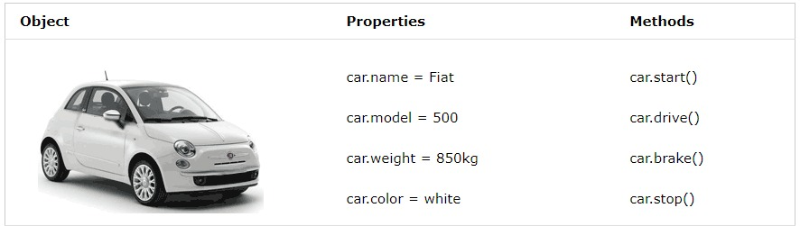

# Frontend crash course
## 1. JAVASCRIPT: :
---
### 1.1 WHAT IS JAVASCRIPT ?

   JavaScript is a programming language that is commonly used for creating dynamic and interactive web pages. It is a high-level, interpreted language, which means that it is executed directly by a web browser without the need for compilation.


### Some key features of JavaScript include:
---
 - Object-oriented programming: JavaScript is an object-oriented language, which means that it allows you to create and manipulate objects with properties and methods.

 - Event-driven programming: JavaScript is event-driven, which means that it allows you to respond to user actions (such as clicks or keystrokes) and other events (such as page loading or timer expiration).

 - Prototypal inheritance: JavaScript uses prototypal inheritance, which allows objects to inherit properties and methods from other objects.

 ### Some common uses of JavaScript include :
---
 - Form validation: JavaScript can be used to validate user input in forms, ensuring that data is entered correctly before it is submitted.

 - User interface effects: JavaScript can be used to create dynamic effects on web pages, such as dropdown menus, animations, and slideshows.

 - Ajax: JavaScript can be used to create asynchronous web applications, allowing data to be sent and received without requiring a full page reload.

 - APIs: JavaScript can be used to interact with external APIs, allowing web applications to access and manipulate data from other sources.

 ### What is ECMAScript :
 ---
 - ECMAScript stands for European Computer Manufacturers Association Script. It is a scripting language specification standardized by ECMA International, a non-profit standards that develops and maintains standards for computing and communications technologies. The ECMAScript specification defines the syntax, semantics, and behavior of the JavaScript language, among others.

 

 ### ECMAScript Vs Javascript
 ---
 - Purpose and History: JavaScript was developed as a scripting language for web development, while Java was developed as a general-purpose programming language for a variety of applications.

 - Syntax: JavaScript syntax is based on C-style syntax, while Java syntax is more similar to C++. However, JavaScript is a loosely typed language, whereas Java is a strongly typed language.

 - Execution: JavaScript code is executed on a web browser or server, while Java code is executed on a Java Virtual Machine (JVM).

 - OOP: Java is a pure object-oriented language, whereas JavaScript is not. JavaScript can use object-oriented concepts, but it is also functional and can be used in a procedural programming style.

 - Libraries and frameworks: JavaScript has a wide variety of libraries and frameworks available for web development, such as React and Angular, while Java has a larger number of libraries and frameworks available for a variety of applications, such as Spring and Hibernate.

   ### *summary* : 
   > *JavaScript and Java are two different programming languages with distinct differences in their purpose, syntax, execution, object-oriented programming, and available libraries and frameworks.*
---


### 1.2 JAVASCRIPT VARIABLES :
---
   Variables are containers for storing data (storing data values)

 - **let** : variables declared using *let* have **block scope**, which means they are only accessible within the block where they are defined.
   In other words, a variable declared using *let* can only be accessed within the **{}** block where it is defined. If you try to access the variable outside of its block, you will get a **ReferenceError**.

   Example :
     ```javascript
     if(true){
        let counter = 20;
     }
     console.log(counter);  // ReferenceError: counter is not defined
     ```
     ```javascript
     let a = 10;
     if(true){
        let a = 20;
        console.log(a);  // 20
     }
     console.log(a);  // 10
     ```

 -  **var** :  variables declared using *var* have **functional scope**, which means they can be accessible anywhere within the function. However, if a variable is defined outside of a function using *var*, it becomes a global variable and can be accessed from anywhere in the code. Variables declared using *var* can be reassigned, and if they are not assigned a value, they will have the value undefined.

    Example :
    ```javascript
    var x =10;
    if(true){
        var x = 20;
        console.log(x);
    }
    console.log(x);
    ```

 -  **const** :  -  *const* also has a **block scope**, but it cannot be reassigned after it has been declared. A const variable must be assigned a value when it is declared and cannot be left uninitialized.

      Example: 
      ```javascript
      const PI = 3.14;
      console.log(PI); // Output: 3.14

      PI = 3.1415; // This will result in an error
      ```

      ### Javascript Data Types :
      ---
      In Javascript mainly there are two types They are :
      - Primitive data type
      - Object/Non-primitive data type

  
      In JavaScript, a primitive data type is a data type that represents a single, immutable value, which means that the value cannot be changed. 
      
      #### Primitive Data Types :
      ---
      - There are five primitive data types in JavaScript : 
          * string 
          - number
          - boolean
          - null
          - undefined
          - BigInt
          - symbol
  

      
   + String : A sequence of characters enclosed in quotes (single or double)
      ```javascript
      let name = "John" ;
      let country = 'India';
      ```
      
   + number : A numeric value, Numbers in JavaScript are always stored as floating-point numbers.
      ```javascript
      let age = 25 ;
      ```
   
   + Boolean : A logical value that can be either true or false. 
      ```javascript
      let isStudent = true; 
      ```

   + null : A special value indicating a null or non-existent value.
      ```javascript
      let value = null;
      ```
      *NOTE : All primitive types, except null, can be tested by the typeof operator. typeof null returns "object", so one has to use === null to test for null.*

      Example :
      ```javascript
      function checkValue(str){
         let a = str;
         if(a === null){
            return 0;
         }
         return a.length;
      }
      console.log(checkValue(null));
      ```

   + undefined :  The Undefined type is inhabited by exactly one value: **undefined**.
      - Conceptually, *undefined* indicates the absence of a value, while *null* indicates the absence of an object (which could also make up an excuse for typeof null === "object"). The language usually defaults to undefined when something is devoid of a value:
  
      Example:
      + A return statement with no value (return;) implicitly returns *undefined*.
         ```javascript
         function checkValue(num){
            let a =10;
            if(a === num){
               return; // if a === num will return #undefined
               }
            return num;
            }
         console.log(checkValue(10));
         ```

      + Accessing a nonexistent object property (obj.iDontExist) returns *undefined*.
         ```javascript
         let myObject = {
            name : "John",
            age : 30
         }
         console.log(myObject.city)  // undefined, because city property is not exist in the object.

         ```
      + A variable declaration without initialization (let x;) implicitly initializes the variable to undefined.
         ```
         let x;
         console.log(x) // undefined because x variable is declared but not defined yet.
         ```
   + BigInt : All JavaScript numbers are stored in a a 64-bit floating-point format.

     - JavaScript BigInt is a new datatype (2020) that can be used to store integer values that are too big to be represented by a normal JavaScript Number.   
  
      Example :
      ```
      let x = BigInt("123456789012345678901234567890");
      ```


      #### Differenece between undefined and null : 
      ---
         typeof null; // "object" (not "null" for legacy   reasons)
         typeof undefined; // "undefined"
         null === undefined; // false
         null == undefined; // true
         null === null; // true
         null == null; // true
         !null; // true
         Number.isNaN(1 + null); // false
         Number.isNaN(1 + undefined); // true
      


      # Object/Non-primitive Data Types :
      ---
      - There are mainly three types :
          + object
          + array
          + date

   # Object : 
   ### The Object type represents one of JavaScript's data types. It is used to store various keyed collections and more complex entities. Objects can be created using the Object() constructor or the object initializer / literal syntax.

     * Example

   ```javascript
         let car = {
            name: "fiat",
            model: 500,
            weight: "850kg",
            color : "white",
            start: function() {
               console.log(`Hello,I am  ${this.name} and I am  ${this.model} model, I can start now`);
               }
            };

            //using dot(.) notation
            console.log(car.name); // "fiat"

            //using bracket notation
            console.log(car["model"]); // 500

            // add properties to the object
            car.engine = "petrol";

            // delete properties from object
            delete car.color;

            // car object with start method
            car.start(); //  Hello,I am  fiat and I am  500 model, I can start now.
   ```
     
   

---
# array : 
   ### In JavaScript, an array is a collection of items or values, which can be of any data type such as numbers, strings, objects, or even other arrays. Arrays in JavaScript are defined as objects with numbered indexes, where each item or element is identified by an index, starting from zero.

   > JavaScript arrays can be created using the Array()  constructor or by using the array literal notation, which is simply a comma-separated list of values enclosed in square brackets ([]). 

   ```javascript
         // Using array literal notation
         let fruits = ['apple', 'banana', 'orange'];

         // Using Array() constructor
         let numbers = new Array(1, 2, 3, 4, 5);

         console.log(fruits[0]); // Output: 'apple'

         console.log(numbers[3]); // Output: 4
   ```
   
   * Date : JavaScript Date objects represent a single moment in time in a platform-independent format. Date objects encapsulate an integral number that represents milliseconds since the midnight at the beginning of January 1, 1970, UTC (the epoch).

      ```javascript
         let myDate = new Date();

         console.log(myDate) // 2023-03-10T03:59:35.852Z

         console.log(myDate.toLocaleString()); //10/3/2023, 11:17:57 am
      ```
---
## Beginner Javascript challenges :
---

### Challenge 1 : 

   1. Create a boolean variable called 'myBoolean' and set it to 'true'.
   ```javascript
      const myBoolean = true;
   ```
   2. Create a string variable called 'myString' and set it to 'hello world'.
   ```javascript
      const myString = 'hello world';
   ```

   3. create a number variable called 'firstNumber' and set it to '20'.
   ```javascript
      const firstNumber = 20;
   ```

   4. create another number variable called 'secondNumber' and set it to '40'.
   ```javascript
      let secondNumber = 40;
   ```

   5. Re-assign 'secondNumber' and set it equal to '80'.
   ```javascript
      secondNumber = 80;
   ```

   6. Create an array called 'myArray' and put 'myBoolean' at index 0, and 'myString' at index 1.
   ```javascript
    const myArray = [myBoolean, myString];
   ```

   7. Create an object called 'myObject' and assign 'myArray' to a property called 'firstProperty', and the sum of 'firstNumber' and 'secondNumber' to a property called 'sumProperty.

   ```javascript
      const myObject = {
       firstProperty: myArray,
       sumProperty: firstNumber + secondNumber
       };
   ```

   8. Print 'myObject' to the console.
   ```javascript
    console.log(myObject);
   ```

   9.  Print the 'sumProperty' of 'myObject' to the console.
   ```javascript
      const sumProp = myObject.sumProperty;
      console.log(sumProp);

      console.log(myObject.sumProperty);
      
   ```

   10. Print the value at index 1 of 'firstProperty'.
   ```javascript 
      console.log(myObject.firstProperty[1]);
   ```
---

### Challenge 2 : 
   * There are three things wrong with this code. Find them and explain why they are wrong.
    
   ```javascript
         const some Number = 30;
         someNumber = 50
   ```
   solution : 

   1. The variable is invalid.  It should be `someNumber`, not `some Number`.  There is an extra space.
   ```javascript
      const someNumber = 30;
   ```

   2. We should be using `let` here because later in the code, we re-assign the value of the variable
   
   ```javascript
   const some Number = 20;
   ```

   3. This line is missing a semi-colon at the end
   someNumber = 50
   ```javascript
      someNumber = 50 ;
   ```
---

### Challenge 3 :

   * What does 'resultVariable' equal? what type is it?
   ```javascript
   const variable1 = 20;
   const variable2 = '40';

   const resultVariable = variable1 + variable2;

   console.log(resultVariable); 
   ```
   solution : The resultVariable will print "2040", and it is a string.
   ```javascript
      console.log(resultVariable);  // 2040
   ```

* You can verify this by executing the following code in the console
   > // This will return "string", which tells us that the variable is a string data type
typeof resultVariable

* The reason for this is because JavaScript is a "weakly typed" language. In this case, we are trying to add a number and a string together. In some programming languages like Python which are "strongly typed", you would get an error trying to do this. But since JavaScript is "weakly typed", it allows you to do operations with multiple variable types at once.
   
* This leads us to the second part of this solution. Since JavaScript allows you to add a number and a string together, you might ask–why does it end up as a string rather than a number?

* This is where the concept of "**implicit type coercion**" comes in. Since we are not explicitly declaring each variable's type (static typing), JavaScript has to figure it out when the code runs. In this case, when you add a string and a number together, it automatically becomes a string, and that is just a rule of JavaScript. 

  * Imagine what would happen with this code:
  ```javascript 
      const stringVariable = 'some value here';
      const numberVariable = 20;

      console.log(stringVariable + numberVariable); // 'some value here20'
  ``` 

   Here, it wouldn't make much sense to convert the result to a number because you can't add these two values! In our first example, you could have converted variable2 into a number and then added them together, but here, you can't convert 'some value here' into a number.

   * Here's how we could have turned the original result into a number:
   ```javascript
      const variable1 = 20;
      const variable2 = '40';

      const resultVariable = variable1 + Number(variable2);

      console.log(resultVariable); // Prints 60, and is a number
   ``` 
   > By using JavaScript's built-in Number() function, we can convert a string to a number
---

### Challenge 4 :

   * Why is this code invalid?
   ```javascript
      const objectVariable = {
      property1: 'i am property 1';
      property2: 'i am property 2';
      property3: [20, 30, 40];
      };

      console.log(objectVariable.property3[2]);
   ```
   - The code above is invalid because it contains semi-colons (;) in the wrong places.

   - When creating objects, you need to place a comma after each object, NOT a semi-colon.
   - Here is the fixed program that will properly run in your Console.
   ```javascript
      const objectVariable = {
         property1: 'i am property 1',
         property2: 'i am property 2',
         property3: [20, 30, 40]
      };

      console.log(objectVariable.property3[2]);
   ``` 

### Challenge 5 :

   * Why does this code not work?
   ```javascript
      const myArray = [20, 30, 40, 50]; 
      console.log(myArray[4]);
   ```
   * The above code is invalid because it attempts to print the value at index 4, but there is no index 4 in this array! because always index value starts from zero in an array, So this array has only 0 to 3 index values.

   ```javascript
      // Index         0   1    2   3
      const myArray = [20, 30, 40, 50];  
   ```

### 1.3 JAVASCRIPT OPERATORS :
---

 ### Arithmetic operators : 
 ---
   * Arithmetic operators take numerical values (either literals or variables) as their operands and return a single numerical value.
    
      - additional operator ( + )
         ```javascript
            let a = 10;
            let b = 20;
            console.log(a+b); // 30
            or 
            console.log(5 + 5)   //10
         ``` 
         
      - multiplication operator ( * )
         ```javascript
           console.log(5 * 5);    // 25
         ```
         
      - substraction operator ( - )
         ```javascript
           console.log(10 - 5); // 5
         ``` 
         
      - division operator ( / )
         ```javascript 
           console.log(10 / 2); // 5
         ``` 
 
      - Exponentiation operator( ** )
         ```javascript
           console.log(10 ** 2) ; //100
         ``` 

      - Remainder operator ( % )
         ```javascript
           console.log(100 % 77);  //23
         ``` 
      - Increment operator :
         ```javascript
            let a = 10;
            a++;
            console.log(a); // 11
         ```
      - Decrement operator :
         ```javascript
            let a = 10;
            a--;
            console.log(a); // 9
         ```
            

   ### Comparision/Relational operators :
   ---
   * A comparison operator compares its operands and returns a boolean value (true/ false) based on whether the comparison is true.
    

      - Less than operator ( < )
         ```javascript  
            let a = 5;
            let b = 10
            console.log(a < b); // true
            or 
            console.log(5 < 10 ) // true
         ```    
      - Greater than operator ( > ) 
         ```javascript
           console.log(5 > 10); // false
         ```  

      - Equal to  ( == ) 
         ```javascript
           console.log(5 == 5 ); // true
         ```  

      - Equal value and same type  ( === ) 
         ```javascript
           console.log(5 === '5' ); // false, because first value number type and second value string type.
         ```  

      - Not equal operator ( != ) 
         ```javascript
           console.log(10 != 10) // false (here it will not compare with data type, compares with only values)
         ```  

      - Not equal value and same type  ( !== ) 
         ```javascript
           console.log(5 !== '5' ); // false, because first value number type and second value string type. 
         ```   

      - Less than or equal operator ( <= ) 
         ```javascript
           console.log(5 <= 5 ); // true
         ```

      - Greater than or equal operator ( >= ) 
         ```javascript
           console.log(5 >= 5 ); // true
         ```  

      - Ternary operator ( ? ) : The ternary operator in JavaScript is a shorthand way to write conditional statements. It allows you to write a quick and concise way of evaluating a condition and returning one of two values based on that condition.

         The syntax for the ternary operator is as follows:
       
         ```javascript
         condition ? value_if_true :  value_if_false;
         ``` 

         Example : 
         ```javascript
            const number = 7;
            const isEven = number % 2 === 0 ? true : false;

            console.log(isEven); // Output: false
         ```
         Solve this :
         ```javascript
            const result = !(((40 / 20) === 2) || ("yes" === "no"));
         ```   


     > Note :( => )is not an operator, but the notation for Arrow functions.

     ### JavaScript Assignment Operators :
     ---

   * These operators are used to assign values to variables. Some of the assignment operators include =, +=, -=, *=, /=, and %=.

        * = (assignment): Assigns a value to a variable. For example:
        ```javascript 
          let x = 5;  
        ```
      * += (addition assignment): Adds a value to a variable and assigns the result back to the variable. For example:
      ```javascript 
        let x = 5;
        x += 3; // equivalent to x = x + 3
        console.log(x); // Output: 8

      ```
      * -= (subtraction assignment): Subtracts a value from a variable and assigns the result back to the variable. For example:
      ```javascript 
         let x = 5;
         x -= 3; // equivalent to x = x - 3
         console.log(x); // Output: 2
      ```

      * *= (multiplication assignment): Multiplies a variable by a value and assigns the result back to the variable. For example:
      ```javascript 
         let x = 5;
         x *= 3; // equivalent to x = x * 3
         console.log(x); // Output: 15 
      ```

      * /= (division assignment): Divides a variable by a value and assigns the result back to the variable. For example:
      ``` javascript
         let x = 5;
         x /= 2; // equivalent to x = x / 2
         console.log(x); // Output: 2.5
      ```

      * %= (modulus assignment): Divides a variable by a value and assigns the remainder back to the variable. For example:
      ```javascript
         let x = 5;
         x %= 2; // equivalent to x = x % 2
         console.log(x); // Output: 1
      ```   
   


     ### JavaScript Logical Operators :
     ---
   * JavaScript provides three logical operators: && (AND), || (OR), and ! (NOT). These operators can be used to combine or invert boolean expressions.

     1. The && operator returns true if both operands are true. Otherwise, it returns false. 
      
         Example :
         ```javascript
         const x = 5;
         const y = 10;
         const z = 15;

         console.log(x < y && y < z); // Output: true
         console.log(x > y && y < z); // Output: false
         ```

      

     2. The || operator returns true if at least one of the operands is true. Otherwise, it returns false.
     
         Example : 
         ```javascript
            const x = 5;
            const y = 10;
            const z = 15;

            console.log(x > y || y < z); // Output: true
            console.log(x > y || y > z); // Output: false
         ```
     
     3. The ! operator inverts the value of a boolean expression. If the expression is true, it returns false, and if it's false, it returns true.
       Example :
         ```javascript
            const x = 5;
            const y = 10;
            const z = 15;

            console.log(!(x > y)); // Output: true
            console.log(!(x < y)); // Output: false

         ```
         

      ### Javascript type operator :
      ---

      * typeof : Returns the type of a variable

         Example 
         ```javascript
            let a = 10;
            let b = "Hello"

            console.log(typeof(a));  // number
            console.log(typeof(b));  // string
         ```

      * instanceof : Returns true if an object is an instance of an object type

        Example : 
        ```javascript
         function Car(make, model, year) {
            this.make = make;
            this.model = model;
            this.year = year;
            }
            const auto = new Car('Honda', 'Accord', 1998);

            console.log(auto instanceof Car);
            // Expected output: true

            console.log(auto instanceof Object);
            // Expected output: true
         ```


   ### challenge #1 :

   * Why doesn't this code work?
      ```javascript
         const numberVariable = 0;

         numberVariable++;
         numberVariable++;
         numberVariable++;

         console.log(numberVariable); 
      ```
   
      => [click here for solution](https://github.com/zachgoll/fullstack-roadmap-series/blob/main/code-challenges/lesson-4/challenge1-solution.md)
   

  ### challenge #2 :
   * Do the following two blocks of code result in the same answer? If not, which one would you recommend using and why?

      ```javascript
         const firstNumber = 20;
         const secondNumber = '20';

         const result = firstNumber === secondNumber;

         console.log(result); 
      ```
      ```javascript
         const firstNumber = 20;
         const secondNumber = '20';

         const result = firstNumber == secondNumber;

         console.log(result); 
      ```
      => [click here for solution](https://github.com/zachgoll/fullstack-roadmap-series/blob/main/code-challenges/lesson-4/challenge2-solution.md)


###  challenge #3 :

   * What does expression5 evaluate to? How could you write this in a single line of code (for exercise purposes only; you would never want to combine all this in one line)?
    
      ```Javascript
         const expression1 = 100 % 50;
         const expression2 = 100 / 50;
         const expression3 = expression1 < expression2;
         const expression4 = expression3 && 300 + 5 === 305;
         const expression5 = !expression4;

         console.log(expression5); 
      ```   

       => [click here for solution](https://github.com/zachgoll/fullstack-roadmap-series/blob/main/code-challenges/lesson-4/challenge3-solution.md)


###  challenge #4 :

   * What does result evaluate to? You might want to review the previous lesson for this one.

      ```javascript
         const myObj = {
         prop1: 'first value',
         prop2: 20
         };

         // Index         0   1   2
         const myArray = [40, 50, 2];

         const result = myObj.prop2 === (myArray[0] / myArray[2]);
      ```

      => [click here for solution](https://github.com/zachgoll/fullstack-roadmap-series/blob/main/code-challenges/lesson-4/challenge4-solution.md)


### challenge #5 :

   * This one is meant to be a tough challenge. You probably will need to Google this and it might take you a while to complete.
   * What does result evaluate to?

      ``` javascript
         const myObj = {
            nestedObject1: {
               price: 100,
               quantity: 5
            },
            nestedObject2: {
               price: 150,
               quantity: 2
            }
            };

            const myArray = [myObj.nestedObject1, myObj.nestedObject2];

            const result = (myArray[0].price * myArray[0].quantity) > (myArray[1].price * myArray[1].quantity); 
      ```

      => [click here for solution](https://github.com/zachgoll/fullstack-roadmap-series/blob/main/code-challenges/lesson-4/challenge5-solution.md)

---

## 1.4 JAVASCRIPT FUNCTIONS, CONDTITIONALS, AND LOOPS :
---

   ## Conditionals : 

   ```javascript
      let firstExpression = 20;
      let secondExpression = 10;
      let jsExpression = firstExpression > secondExpression;  // true

      // only if statement ::
      if(jsExpression){
         console.log("this expression is true");
      }
      // when jsExpression is true then only if condition will excecute.
   ```  

   ```javascript
   // An "if-else" statement
      if(jsExpression){
         console.log("this expression is true");
      }else{
         console.log("this expression false");
      }
   ```
   ```javascript
      if(jsExpression){
         console.log("this expression is true");
      }else if(firstExpression > 0){
         console.log("this expression is false and first number is greater than 0")
      }
      else{
         console.log("expression is false and first number is 0 or less ");
      }
   ```
---
   ## Switch Statement :
   ---

   * lets how if-else-if and switch statements works ::

   when we used  _**if-else-if**_ used for more conditionals ::
   ```javascript
      let colors = ['red', 'blue', 'green', 'orange', 'black'];

      const randomIndex = Math.floor(Math.random() * colors.length);

      let randomColor = colors[randomIndex];

      // Conditionals
      if(randomColor === 'red'){
         console.log('the color is red');
      }
      else if(randomColor === 'blue'){
         console.log('the color is blue');
      }
      else if(randomColor === 'green'){
         console.log('the color is green');
      }
      else if(randomColor === 'orange'){
         console.log('the color is orange');
      }
      else if(randomColor === 'black'){
         console.log('the color is black');
      }else{
          console.log('No color found');
      }
   ```   

   *  When we use _**switch statement**_ for the same above condionals ::

   ```javascript
      let colors = ['red', 'blue', 'green', 'orange', 'black'];

      const randomIndex = Math.floor(Math.random() * colors.length);

      let randomColor = colors[randomIndex];   

      switch (randomColor){
         case 'red' :
            console.log('the color is red');
            break;
         case 'blue' :
            console.log('the color is blue');
            break;
         case 'green' :
            console.log('the color is green');
            break;
         case 'orange' :
            console.log('the color is orange');
            break;
         case 'black' :
            console.log('the color is black');
            break;

         default :
            console.log('No color found');
      }
   ```   
---
   ## Loops in Javascript :
   ---

   * **for** loop : A for loop is used to iterate over elements of an array or execute a block of code a fixed number of times. The loop consists of an initialization expression, a condition expression, and an update expression, and the code inside the loop is executed as long as the condition is true. Here's an example:

   ```javascript 
      for(let i = 0; i < 10; i++){
         console.log(i);
      }
   ```
   ```javascript 
      // return the elements which number data types in an array using for loop
      // hint : we can use typeof operator here
      let arr = ['hello', 'world', 20, 'john', 30, 50, true, false];
      for(let i=0; i< arr.length; i++){
        if(typeof arr[i] === 'number'){
            console.log(arr[i]);
        }
      }
   ```

   * **while** loop : A 'while' loop is used to execute a block of code repeatedly as long as a condition is true. The loop consists of a condition expression, and the code inside the loop is executed as long as the condition is true. Here's an example:
   ```javascript
         let i = 0;
         while(i < 10){
            console.log(i);
            i++;  
         }  // 0,1,2,3,4,5,6,7,8,9
   ```     

   * **Do-while** loop : A do-while loop is similar to a while loop, but the condition is checked at the end of the loop instead of at the beginning. This means that the code inside the loop is always executed at least once. Here's an example:
 
   ```javascript
      let i = 0;
      do{
         console.log(i);
         i++;
      } while(i < 10);  //0,1,2,3,4,5,6,7,8,9
   ```

   * **for-in** loop :A for...in loop is used to iterate over the properties of an object. The loop iterates over all enumerable properties of an object and executes the code inside the loop for each property. Here's an example:
   ```javascript
      const obj = {name: 'John', age: 30, city: 'New York'};
      for(let prop in obj){
         console.log(prop + ': ' + obj[prop]);
      }
   ```

   * **for-of** loop : A for...of loop is used to iterate over elements of an iterable object, such as an array. The loop iterates over each element of the iterable object and executes the code inside the loop for each element. Here's an example:
   ```javascript
      const arr = ['apple', 'banana', 'orange'];
      for(let fruit of arr){
         console.log(fruit);
      }  //apple, banana, orange
   ```   

   ## Functions in Javascript :
   ---
 
   * Functions are used to group code together into reusable blocks, which can be called and executed multiple times with different arguments. Functions can also return values, making them useful for performing calculations or manipulating data.


      * Here's an example of a simple JavaScript function:
      ```javascript
         // here name is a parameter
         function greet(name) {
            console.log("Hello, " + name + "!");
         }
         // call the function and pass the argument
         greet('Jack');
      ```
      * Functions can also return values using the return keyword: 
      ```javascript
        // Here calculate the sum of two numbers, and return the result:
         function add(a, b) {
            return a + b;
         }

         let sum = add(2, 3); 
         console.log(sum) // sum is now 5
      ```

   * Function Expression : These are functions that are assigned to a variable or passed as an argument to another function. They can be named or anonymous.

      ```javascript
         let add = function(a, b) {
            return a + b;
         };

         add(5,5) // 10
      ```

   * Arrow Functions : These are a shorthand syntax for writing function expressions, using the => arrow notation. They are often used for concise one-line functions.
      ```javascript
         let add = (a, b) => a + b;
            or
          // using return keyword
         let add = (a,b) => {
            return a + b;
         }

         let result = add(5,5);
         console.log(result);
      ```

   *  Method Functions: These are functions that are defined as properties of an object. They are called using the object's name followed by the property name, and they have access to the object's properties using the this keyword.
     
      _(hint : here we have used **this** keyword, which is explained after this example)_

      ```javascript
         var person = {
            name: "John",
            greet: function() {
               console.log("Hello, " + this.name + "!");
            }
         };

         person.greet(); //  "Hello, John!"
      ```
      ---
      ### What is **this**?
      * In JavaScript, the **this** keyword refers to an object.
      * Which object depends on how this is being invoked (used or called).

      ```javascript
         const person = {
            firstName: "John",
            lastName : "Doe",
            id       : 5566,
            fullName : function() {
               return this.firstName + " " + this.lastName;
            } // here this refers to a person object
         }; 
         perosn.fullname();  // John Doe
      ```

      ---

   * **Anonymous functions** are often used as **callbacks** to other functions or as **immediately invoked function expressions (IIFE)**, which are functions that are executed immediately after they are defined. Here's an example of an IIFE that defines a function and immediately calls it:
      ```javascript
         (function() {
            let message = "Hello, world!";
            console.log(message);
         })(); // now function will immediately calls itself
      ```

   NOTE : Important to notice in javascript funtions - **Local variables**

   * Variables declared within a JavaScript function, become LOCAL to the function.

   * Local variables can only be accessed from within the function.
   ```javascript
      // code here can NOT use carName

      function myFunction() {
      let carName = "Volvo";  // now carName is local scoped variable
      // code here CAN use carName and accessible only within function
      }

      // code here can NOT use carName
   ``` 
---
   ### BEGINNER PRACTICE PROBLEMS : 
---
reference => [codewars.com](https://www.codewars.com/collections/lesson-5-practice-challenges-number-fullstackroadmap)


   1. Multiply number :  This code does not execute properly. Try to figure out why.
      ```javascript
         function multiply(a, b){
            a * b
         }
      ```

   2. The function is not returning the correct values. Can you figure out why?
      ```javascript
            function getPlanetName(id){
               var name;
               switch(id){
                  case 1:
                     name = 'Mercury'
                  case 2:
                     name = 'Venus'
                  case 3:
                     name = 'Earth'
                  case 4:
                     name = 'Mars'
                  case 5:
                     name = 'Jupiter'
                  case 6:
                     name = 'Saturn'
                  case 7:
                     name = 'Uranus'
                  case 8:
                     name = 'Neptune'
               }
               
               return name;                        
            }

            getPlanetName(8, 2);
      ```

   3. Odd/Even : Create a function that takes an integer as an argument and returns "Even" for even numbers or "Odd" for odd numbers.
      ```javascript
       function evenOrOdd(number) {

       }
      ```
   
   4. Counting sheep : Consider an array/list of sheep where some sheep may be missing from their place. We need a function that counts the number of sheep present in the array (true means present).

      for Example :
   
      ```javascript
               [true,  true,  true,  false,
               true,  true,  true,  true ,
               true,  false, true,  false,
               true,  false, false, true ,
               true,  true,  true,  true ,
               false, false, true,  true]
      ```
      * The correct answer would be 17.
      * Hint : Don't forget to check for bad values like **null/undefined**


   5. Vowels count : Return the number (count) of vowels in the given string.

   * We will consider a, e, i, o, u as vowels for this example
    
     exapmple :
       ```javascript
         function getCount(str) {
               // code here
         }

         console.log(getCount("abdhsiiwend")); // should return 4
      ```
   
   6. Jenny's secret message : Jenny has written a function that returns a greeting for a user. However, she's in love with Johnny, and would like to greet him slightly different. She added a special case to her function, but she made a mistake.

      Can you help her?
      * Hint : if name is equal to 'Johnny' then should return "Hello, my love!" otherwise should return normal greet, for example "Hello, jim"
      ```javascript
         function greet(name){
            return "Hello, " + name + "!";
            if(name === "Johnny")
               return "Hello, my love!";
            }
      ```

   7. Is n divisible by x and y?
    
      *  Create a function that checks if a number n is divisible by two numbers _x AND y_. All inputs are positive, non-zero numbers.
      ```javascript 
         Examples:
         1) n =   3, x = 1, y = 3 =>  true because   3 is divisible by 1 and 3
         2) n =  12, x = 2, y = 6 =>  true because  12 is divisible by 2 and 6
         3)  n = 100, x = 5, y = 3 => false because 100 is not divisible by 3
         4)  n =  12, x = 7, y = 5 => false because  12 is neither divisible by 7 nor 5  
      ```

   8. Return Negative : 
      * In this simple assignment you are given a number and have to make it negative. But maybe the number is already negative?
      ---
      Examples (input -> output)
      ```javascript
         makeNegative(1);    // return -1
         makeNegative(-5);   // return -5
         makeNegative(0);    // return 0
         makeNegative(0.12); // return -0.12
      ```  
      ---
   
   9. String repeat : 
      * Write a function that accepts an integer n and a string s as parameters, and returns a string of s repeated exactly n times.
      ---
      Examples (input -> output)
      ```javascript 
         6, "I"     -> "IIIIII"
         5, "Hello" -> "HelloHelloHelloHelloHello"

      ```
      ---

   10. Remove String Spaces :
       * Write a function that removes the spaces from the string, then return the resultant string.
         
       ---
       Examples (input -> output)
       ```javascript

         "8 j 8   mBliB8g  imjB8B8  jl  B" -> "8j8mBliB8gimjB8B8jlB"
         "8 8 Bi fk8h B 8 BB8B B B  B888 c hl8 BhB fd" -> "88Bifk8hB8BB8BBBB888chl8BhBfd"
         "8aaaaa dddd r     " -> "8aaaaaddddr"
       ```
       ---

   11. Grasshopper - Summation :
       * Write a program that finds the summation of every number from 1 to num. The number will always be a positive integer greater than 0.

       ---
       Examples (input -> output)
       ```javascript
         2 -> 3 (1 + 2)
         8 -> 36 (1 + 2 + 3 + 4 + 5 + 6 + 7 + 8)
       ```
       ---

   12. Find the smallest integer in the array :
       * Given an array of integers your solution should find the smallest integer.
       --- 
       Examples (input -> output)
       ```javascript
         Given [34, 15, 88, 2] your solution will return 2
         Given [34, -345, -1, 100] your solution will return -345

         You can assume that the supplied array will not be empty.
       ```
       ---

   13.  Reversed Strings :
        * Complete the solution so that it reverses the string passed into it.

        --- 
        Examples (input -> output)
         ```javascript
            'world'  =>  'dlrow'
            'word'   =>  'drow'
         ```
         ---

   14. Century From Year : 
       * The first century spans from the year 1 up to and including the year 100, the second century - from the year 101 up to and including the year 200, etc.

       ---
       Task : Given a year, return the century it is in.

         Examples
        ```javascript
         1705 --> 18
         1900 --> 19
         1601 --> 17
         2000 --> 20

        ```
        ---

   15. Basic Mathematical Operations :
       * Your task is to create a function that does four basic mathematical operations.

       * The function should take three arguments - operation(string/char), value1(number), value2(number).

       * The function should return result of numbers after applying the chosen operation.
       ---
       Examples(Operator, value1, value2) --> output
       ```javascript
            ('+', 4, 7) --> 11
            ('-', 15, 18) --> -3
            ('*', 5, 5) --> 25
            ('/', 49, 7) --> 7
       ```

---
# Callback Functions : 
---
   A callback function is a function passed into another function as an argument, which is then invoked inside the outer function to complete some kind of routine or action.

   1. Here is a quick example:
   ```javascript
      function greeting(name) {
         alert(`Hello, ${name}`);
      }

      function processUserInput(callback) {
         const name = prompt("Please enter your name.");
         callback(name);
      }

      processUserInput(greeting);
   ```
   * The above example is a synchronous callback, as it is executed immediately.

  ---
  2. Callback function with three parameter
   ```javascript
      function myCallback(num){
         return num * 2;
      } 

      function mainFunction(randomNumber, shouldCall, callback){
         let result = randomNumber; // in this example result === 20

         // in this example, shouldCall is 'true', so we do reach the callback
         if(shouldCall){
            // in this example, 'callback' represents 'myCallback' from above
            result = callback(randomNumber);
         }
         // since 'result' was re-assigned by the callback function, returns 40
         return result;
      }

      mainFunction(20, true, myCallback); // returns 40
   ```
   
   * In the same way, we can use "map" method in callback
   * The map() method creates a new array populated with the results of calling a provided function on every element in the calling array.

   Here's an simple example :
   ```javascript
      let arr = [1,2,3,4];

      function doubleMapCallback(itemFromArray){
         return itemFromArray * 2;
      }

      const newArray = arr.map(doubleMapCallback);
      console.log(newArray); // [2, 4, 6, 8]
   ```

   ```javascript
      const array1 = [1, 4, 9, 16];

      // Pass a function to map
      const map1 = array1.map(x => x * 2);

      console.log(map1);
      // Expected output: Array [2, 8, 18, 32]

   ```

---
### Javascript primitives :
---

   ```javascript 
      const string1 = new String("Hello, world!");
      const string2 = "Hello, world!";
      console.log(string1 === string2) // false
      console.log(string1 == string2) // true
   ```

---
### Javascript Date :
---
   * The Date object works with dates and times.

   * Date objects are created with new Date().

   * JavaScript Date objects represent a single moment in time in a platform-independent format. Date objects encapsulate an integral number that represents milliseconds since the midnight at the beginning of January 1, 1970, UTC (the epoch).

   * There are four ways of instantiating (creating) a date:


   ```javascript
      //new Date() creates a new date object with the current date and time:
      const date = new Date();
      console.log(date);
      //Tue Apr 04 2023 18:51:24 GMT+0530 (India Standard Time)
   ```

   ```javascript
      // JavaScript stores dates as milliseconds from Jan 1, 1970.
      let newDate = new Date(100000000000);
      console.log(newDate);
      //Sat Mar 03 1973 15:16:40 GMT+0530 (India Standard Time)
   ```


   ```javascript
      // Date string : Create a date using ISO notation
      let newDate = new Date("2015-03-25");
      console.log(newDate);
      //Wed Mar 25 2015 05:30:00 GMT+0530 (India Standard Time)
   ```

   ```javascript
      //new Date(7 numbers) creates a date object with the specified date and time:
      //new Date(year, month, day, hours, minutes, seconds, milliseconds);
      const myDate = new Date(2018, 11, 24, 10, 33, 30, 0);
      console.log(myDate);
      //Mon Dec 24 2018 10:33:30 GMT+0530 (India Standard Time)
   ```

---
## JavaScript Regular Expressions :
---

### What Is a Regular Expression?
  * A regular expression is a sequence of characters that forms a search pattern.
  * The search pattern can be used for text search and text replace operations.
  * When you search for data in a text, you can use this search pattern to describe what you are searching for.

  * A regular expression can be a single character, or a more complicated pattern.

  * Regular expressions can be used to perform all types of text search and text replace operations.

  Syntax : 
  >  /pattern/modifiers;

  Example : 
  > /hello world/i

  Example explained:

   * /hello world/i  is a regular expression.

   * 'hello world'  is a pattern (to be used in a search).

   * i  is a modifier (modifies the search to be case-insensitive).

   #### Using **String Methods** :

   * The search() method uses an expression to search for a match, and returns the position of the match.

      Example:
      ```javascript
      let text = "My name is RegExp"; 
       let n = text.search(/name/);
      console.log(n); // 3
      //Search a string for "name", and log the position of the match.
      ```

   * The replace() method returns a modified string where the pattern is replaced.
   Example:
      ```javascript
      let text = "My name is RegExp"; 
      let n = text.replace(/RegExp/i, "Javascript");
      console.log(n); // "My name is Javascript"
      //Replace "RegExp" with "Javascript" in the text.
      ```

---
   #### Regular Expression Modifiers :
* i : 	Perform case-insensitive matching 
   
   Example:

   ```javascript
      let text = "My name is RegExp"; 
      let n = text.search(/Name/i);
      console.log(n); // 3
      //Do a case-insensitive search for "Name" in a string
   ```

* g : 	Perform a global match (find all matches rather than stopping after the first match)

   Example:

   ```javascript
      let text = "Is this all there is?";
      let result = text.match(/is/g);
      console.log(result); // is,is
      //Do a global search for "is" in a string
   ```

* m : 	Perform multiline matching

   Example:
   ```javascript
      let text = "\nIs th\nis it?";
      let result = text.match(/^is/m);
      console.log(result) //  is
      //Do a multiline search for "is" at the beginning of each line in a string
   ```
---
#### Regular Expression Patterns
* Brackets are used to find a range of characters:

   Example:
   ```javascript
      let str = "This is an example string";
      let regex = /[aeiou]/gi;
      let result = str.match(regex);
      console.log(result); // ["i", "i", "a", "e", "a", "e", "i"]

      //In this example, we used the regular expression /[aeiou]/gi to find all occurrences of vowels (a, e, i, o, or u) in the string str
   ```

   ```javascript
      let text = "125637489";
      let result = text.match(/[1-4]/g);
      console.log(result); // 1,2,3,4
   ```

   ```javascript
      let text = "re, green, red, green, gren, gr, blue, yellow";
      let result = text.match(/(red|green)/g);
      console.log(result); //green,red,green
   ```

* Metacharacters are characters with a special meaning :
   * \d : Find a digit

      Example :
      ```javascript
         let text = "Give 100%!"; 
         let result = text.match(/\d/g);
         console.log(result); //1,0,0
      ```

   * \s : Find a whitespace character

      Example :
      ```javascript
         let str = "This is an example string";
         let regex = /\s/g;
         let result = str.match(regex);
         let count = result ? result.length : 0;
         console.log(count); // 4

         //In this example, we use the regular expression /\s/g to find all occurrences of white spaces (spaces, tabs, and line breaks) in the string str
      ```

   * \b : Find a match at the beginning of a word
      Example :
      ```javascript
         let text = "HELLO, LOOK AT YOU!"; 
         let result = text.search(/\bLO/);
         or
         let result = text.search(/LO\b/);
         console.log(result); // 3

         //In this example, we use the regular expression /\s/g to find all occurrences of white spaces (spaces, tabs, and line breaks) in the string str
      ```

### Using test() : 
   * The test() method is a RegExp expression method.

   * It searches a string for a pattern, and returns true or false, depending on the result.

   Example : 
   ```javascript 
      const pattern = /e/;
      let result = pattern.test("The best things in life are free!"); 
      console.log(result); // true

      // Search for an "e" in the line of string is 'e' letter exists in string it will return true otherwise returns false
   ```

### Using exec() :
   * The exec() method is a RegExp expression method.

   * It searches a string for a specified pattern, and returns the found text as an object.

   * If no match is found, it returns an empty (null) object.

   Example :
   ```javascript
      let findWord = /best/.exec("The best things in life are free!");

      console.log(findWord);  // ["best]
   ```

---

## String Built-in Methods :
---
* **replaceAll()** : The replaceAll() method returns a new string with all matches of a pattern replaced by a replacement.

   Example :
   ```javascript
      const myString = "My Dog jumped on the bed, My dog is bad Dog";
      const newString = myString.replaceAll("Dog", "Cat");
      console.log(newString);
      // here replaceAll method is replacing "Dog" with "Cat" but "dog" is not replaced yet, because of here we haven't used case sensitive.

      // let's try with RegExp

      let regExp = /Dog/gi;
      let correctStr = myString.replaceAll(regExp, "Monkey");
      console.log(correctStr);

      // here "My Monkey jumped on the bed, My Monkey is bad Monkey"
   ```

* **toUpperCase()** :
   ```javascript
      const sentence = 'hello world!';

      console.log(sentence.toUpperCase());
      // Expected output: ""HELLO WORLD!"
   ```

* **toLowerCase()** :
   ```javascript
      const sentence = 'HELLO WORLD!';

      console.log(sentence.toLowerCase());
      // Expected output: "hello world!"
   ```

* **substring()** : The substring() method returns the part of the string from the start index up to and excluding the end index, or to the end of the string if no end index is supplied.

   Example : 
   ```javascript
      const str = 'some string';

      console.log(str.substring(1, 3));
      // Expected output: "om"

      console.log(str.substring(2));
     // Expected output:"me string"

   ```
> Question : make first letter of string as capitalize and rest of the letters should be in lower case.

  

   ```javascript
   // Solution : 

         const str = 'some string';
         const result = str[0].toUpperCase() + str.substring(1, str.length);
         console.log(result); // "Some string"

   ```


* **includes()** : The includes() method performs a case-sensitive search to determine whether one string may be found within another string, returning true or false as appropriate.

    ```javascript

         const sentence = 'The quick brown fox jumps over the lazy dog.';
         const word = 'fox';

         console.log(`The word "${word}" ${sentence.includes(word) ? 'is' : 'is not'} in the sentence`);
         // Expected output: "The word "fox" is in the sentence"

   ```

---

## Array Built-in Methods :
---
### Arrays in JavaScript are a type of object that allow you to store and access multiple values in a single variable.

   * JavaScript arrays are resizable and can contain a mix of different data types. (When those characteristics are undesirable, use *"typed arrays"* instead.)

   * JavaScript typed arrays are array-like objects that provide a mechanism for reading and writing raw binary data in memory buffers.

   ---


## Modifying Values in an Array

You can modify values in an array by assigning a new value to a specific index, like this:

```javascript
myArray[2] = 100;
```

This would change the value at index 2 from 3 to 100.

---

## Adding and Removing Values from an Array

There are several methods you can use to add values to an array:

- push()
- unshift()
- splice()

---

## To remove values from an array, you can use the 
- pop()
- shift() 
- slice() 

---

## Iterating Over an Array

You can use loops to iterate over an array and perform an action for each value in the array. 

```javascript
   let myArray = [1,2,3,4,5];
   for (let i = 0; i < myArray.length; i++) {
  console.log(myArray[i]);
} // 1,2,3,4,5
```
---

## **push()** : 
The push() method adds the specified elements to the end of an array and returns the new length of the array.

   Example : 
   ```javascript 
      const animals = ['pigs', 'goats', 'sheep'];

      const count = animals.push('cows');
      console.log(count); // 4

      console.log(animals); // ['pigs', 'goats', 'sheep', 'cows'];
      
   ```
---

## **unshift()** :
   The unshift() method adds the specified elements to the beginning of an array and returns the new length of the array.

   Example : 
   ```javascript 
      cconst array1 = [1, 2, 3];

      console.log(array1.unshift(4, 5));
      // Expected output: 5

      console.log(array1);
      // Expected output: Array [4, 5, 1, 2, 3]
   ```
---

## **pop()** :
   
   The pop() method removes the last element from an array and returns that element. This method changes the length of the array.

   ```javascript 
      const plants = ['broccoli', 'cauliflower', 'cabbage', 'kale', 'tomato'];

      console.log(plants.pop());
      // Expected output: "tomato"

      console.log(plants);
      // Expected output: Array ["broccoli", "cauliflower", "cabbage", "kale"]

      plants.pop(); // "kale"

      console.log(plants);
      // Expected output: Array ["broccoli", "cauliflower", "cabbage"]

   ```

   ---

## **shift()** :
   
   The shift() method removes the first element from an array and returns that removed element. This method changes the length of the array.

   ```javascript 
      const array1 = [1, 2, 3];

      const firstElement = array1.shift();

      console.log(array1);
      // Expected output: Array [2, 3]

      console.log(firstElement);
      // Expected output: 1

   ```

   ---

## **slice()** :
   
   The slice() method returns a shallow copy of a portion of an array into a new array object selected from start to end (end not included) where start and end represent the index of items in that array. The original array will not be modified.

   ```javascript 
      const animals = ['ant', 'bison', 'camel', 'duck', 'elephant'];

      console.log(animals.slice(2));
      // Expected output: Array ["camel", "duck", "elephant"]

      console.log(animals.slice(2, 4));
      // Expected output: Array ["camel", "duck"]

      console.log(animals.slice(1, 5));
      // Expected output: Array ["bison", "camel", "duck", "elephant"]

      console.log(animals.slice(-2));
      // Expected output: Array ["duck", "elephant"]

      console.log(animals.slice(2, -1));
      // Expected output: Array ["camel", "duck"]

      console.log(animals.slice());
      // Expected output: Array ["ant", "bison", "camel", "duck", "elephant"]

   ```

   ---

   ## **splice()** :
   
   The splice() method changes the contents of an array by removing or replacing existing elements and/or adding new elements in place. To access part of an array without modifying it, see slice().

   ```javascript 
      const months = ['Jan', 'March', 'April', 'June'];
      months.splice(1, 0, 'Feb');
      // Inserts at index 1
      console.log(months);
      // Expected output: Array ["Jan", "Feb", "March", "April", "June"]

      months.splice(4, 1, 'May');
      // Replaces 1 element at index 4
      console.log(months);
      // Expected output: Array ["Jan", "Feb", "March", "April", "May"]

   ```
---


## **map()** : 
The map() method creates a new array populated with the results of calling a provided function on every element in the calling array.

   Here is an example of using map to double the each of an array of numbers: 
   ```javascript 
      const array1 = [1, 4, 9, 16];

      // Pass a function to map
      const map1 = array1.map(x => x * 2);

      console.log(map1);
      // Expected output: Array [2, 8, 18, 32]

   ```

---
## **forEach()** : 
The forEach method allows you to perform an action for each value in an array. 

* The forEach() method is an iterative method. It calls a provided callbackFn function once for each element in an array in ascending-index order. Unlike map(), forEach() always returns undefined and is not chainable. The typical use case is to execute side effects at the end of a chain.

   Example : 
   ```javascript 
      const array1 = ['a', 'b', 'c'];

      array1.forEach((element, index) => {
         console.log(element);
         console.log(index);
         })

   ```
---
## **filter()** : 
The filter() method creates a shallow copy of a portion of a given array, filtered down to just the elements from the given array that pass the test implemented by the provided function.

   Here is an example of using filter to print the elements which are greater than 10 in an array:
   ```javascript 
      const arr = [1,4,6,8,10,14,20,25];

      const result = arr.filter(element => element > 10);

      console.log(result);
      // Expected output: [14, 20, 25]

   ```

   ```javascript
      const arr = [
      {
      product : "tea pot",
      isDigital : false,
      isCancelled: false
      },
      {
      product : "flower pot",
      isDigital : true,
      isCancelled: false
         },
      {
         product : "TV",
      isDigital : true,
      isCancelled: true
         }
      ];

      const result = arr.filter(element => {
        return element.isDigital && element.isCancelled;
      });

      console.log(result); 

      // output : 
      //{
      //   isCancelled: true,
      //   isDigital: true,
      //   product: "TV"
      // }
   ```

---

## **reduce()** : 
The reduce method allows you to reduce an array to a single value by applying a callback function to the values in the array. 

Here is an example of using reduce to calculate the sum of an array of numbers:

   ```javascript
      let myArray = [1, 2, 3, 4, 5];
      let sum = myArray.reduce(function(acc, value) {
      return acc + value;
      }, 0);
      console.log(sum);
   ```

---


## **concat()** : 
The concat() method is used to merge two or more arrays. This method does not change the existing arrays, but instead returns a new array.

   Example : 
   ```javascript 
      const array1 = ['a', 'b', 'c'];
      const array2 = ['d', 'e', 'f'];
      const array3 = array1.concat(array2);

      console.log(array3);
      // Expected output: Array ["a", "b", "c", "d", "e", "f"]
   ```

---
## **sort()** : 
   * The sort() method sorts the elements of an array in place and returns the reference to the same array, now sorted.
   * The default sort order is ascending, built upon converting the elements into strings, then comparing their sequences of *UTF-16 code* units values.

   Example : 
   ```javascript 
      const months = ['March', 'Jan', 'Feb', 'Dec'];
      months.sort();
      console.log(months);
      // Expected output: Array ["Dec", "Feb", "Jan", "March"]

      const array1 = [1, 30, 4, 21, 100000];
      array1.sort();
      console.log(array1);
      // Expected output: Array [1, 100000, 21, 30, 4]
   ```

---
## **includes()** : 
   * The includes() method determines whether an array includes a certain value among its entries, returning true or false as appropriate.

   Example : 
   ```javascript 
      const array1 = [1, 2, 3];

      console.log(array1.includes(2));
      // Expected output: true

      const pets = ['cat', 'dog', 'bat'];

      console.log(pets.includes('cat'));
      // Expected output: true

      console.log(pets.includes('at'));
      // Expected output: false
   ```

---

# Math Utilities :
---
- The Math namespace object contains static properties and methods for mathematical constants and functions.

### **Math.PI** : 
   The Math.PI static data property represents the ratio of the circumference of a circle to its diameter, approximately 3.14159.
   ```javascript
      function calculateCircumference(radius) {
      return 2 * Math.PI * radius;
      }

      console.log(Math.PI);
      // Expected output: 3.141592653589793

      console.log(calculateCircumference(10));
      // Expected output: 62.83185307179586
   ```
---
### **Math.max()** : 
   The Math.max() static method returns the largest of the numbers given as input parameters, or -Infinity if there are no parameters.
   ```javascript
      console.log(Math.max(1, 3, 2));
      // Expected output: 3

      console.log(Math.max(-1, -3, -2));
      // Expected output: -1

      const array1 = [1, 3, 2];

      console.log(Math.max(...array1));
      // Expected output: 3
   ```
---
### **Math.min()** : 
   The Math.min() static method returns the smallest of the numbers given as input parameters, or Infinity if there are no parameters.

   ```javascript
      console.log(Math.min(2, 3, 1));
      // Expected output: 1

      console.log(Math.min(-2, -3, -1));
      // Expected output: -3

      const array1 = [2, 3, 1];

      console.log(Math.min(...array1));
      // Expected output: 1

   ```
### **Math.random()** : 
  The Math.random() static method returns a floating-point, pseudo-random number.

   ```javascript
      function getRandomInt(max) {
      return Math.floor(Math.random() * max);
      }

      console.log(getRandomInt(3));
      // Expected output: 0, 1 or 2

   ```
   ---
### **Math.sqrt()** : 
   The Math.sqrt() static method returns the square root of a number.

   ```javascript
      console.log(Math.sqrt(16)); //4
   ```
   ---
### **Math.pow()** : 
   The Math.pow() static method returns the value of a base raised to a power.

   ```javascript
      console.log(Math.sqrt(16)); //4
   ```
   ---
### **Math.round()** : 
  The Math.round() static method returns the value of a number rounded to the nearest integer.

   ```javascript
      console.log(Math.round(0.9));
   ```
   ---
### **Math.floor()** : 
  The Math.floor() static method always rounds down and returns the largest integer less than or equal to a given number.

   ```javascript
      console.log(Math.floor(5.95)); // 5
   ```
   ---
### **Math.ceil()** : 
  The Math.ceil() static method always rounds up and returns the smaller integer greater than or equal to a given number.

   ```javascript
      console.log(Math.ceil(5.11)); // 6
   ```
---
  Refer :  [mdn web docs](https://developer.mozilla.org/en-US/docs/Web/JavaScript/Reference/Global_Objects/Math)

---

# Error types : 
### Error objects are thrown when runtime errors occur. The Error object can also be used as a base object for user-defined exceptions. 

   See below for standard built-in error types: 
 *  **RangeError** : A number "out of range" has occurred
   
   Example : You cannot set the number of significant digits of a number to 500:
   ```javascript
      let num = 1;
      try {
      num.toPrecision(500);
      }
      catch(err) {
      console.log(err.name); // "RangeError"
      }
   ```
   ---

 *  **ReferenceError** :An illegal reference has occurred.
   
      Example : You cannot use the value of a non-existing variable :
      ```javascript
         let x = 5;
         try {
            x = y + 1;
         }
         catch(err) {
         console.log(err.name); // "ReferenceError"
         }
      ```
   ---
 *  **SyntaxError** : The SyntaxError object represents an error when trying to interpret syntactically invalid code.
      * Creates a new SyntaxError object.
   
      Example : You cannot use the value of a non-existing variable :
      ```javascript
         try {
         eval("hoo bar");
         } catch (e) {
         console.error(e.name); // "SyntaxError"
         }
      ```
   ---
*  **TypeError** : The TypeError object represents an error when an operation could not be performed, typically (but not exclusively) when a value is not of the expected type.

* A TypeError may be thrown when:
   * an operand or argument passed to a function is incompatible with the type expected by that operator or function; or
   * when attempting to modify a value that cannot be changed; or
   * when attempting to use a value in an inappropriate way.
   
      Example : You cannot convert a number to upper case :
      ```javascript
        let num = 1;
         try {
         num.toUpperCase();
         }
         catch(err) {
         console.log(err.name); //TypeError
         }
      ```
   ---

*  **URIError** : The URIError object represents an error when a global URI handling function was used in a wrong way.
   * URIError is a subclass of Error.
   
      Example : Some characters cannot be URI decoded :
      ```javascript
        try {
         decodeURI("%%%");
         }
         catch(err) {
         console.log(err.name); //URIError
         }
      ```
   ---


